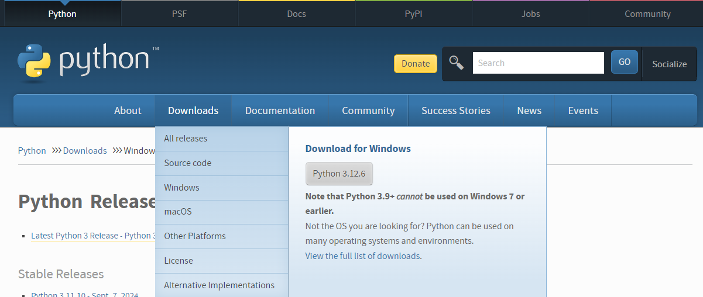

# Configuração de Ambiente de Desenvolvimento para Engenheiro de Dados no Windows
| Data | Descrição |
| ----------- | ----------- |
| Criação | 08/09/2024 |
| Edição | 09/09/2024 |

## Resumo
Este tutorial visa orientar na configuração de um ambiente de desenvolvimento voltado para soluções de dados no Windows. As ferramentas envolvem Python, VS Code, Git, ambientes de desenvolvimento virtualizados, gerenciamento de pacotes, ferramentas de banco de dados e Docker. Vamos abordar desde a instalação até a configuração básica de cada ferramenta.

### 1. Instalação e Configuração do Python
Instalação:

1. Acesse o site oficial: [https://www.python.org/downloads/windows/](https://www.python.org/downloads/windows/]
2. Baixe e instale a versão mais recente do Python.
3. Durante a instalação, certifique-se de marcar a opção **"Add Python to PATH"**.

Verificar Instalação:
```bash
python --version
```
### 2. Visual Studio Code (VS Code)
Instalação:
1. Baixe o instalador em VS Code e siga as instruções [https://code.visualstudio.com/download](https://code.visualstudio.com/download).
2. Instale as Extensões (Recomendadas):
 - Python: Suporte ao desenvolvimento em Python.
 - Jupyter: Para rodar notebooks diretamente no VS Code.
 - Material Icons: Melhora a aparência visual com ícones de arquivos específicos.
 - Kite Autocomplete: Completação de código assistida por IA.
 - AutoDocString: Geração automática de docstrings.
 - Python Snippets: Fornece snippets de código prontos.
 - Edit CSV: Facilita a edição de arquivos CSV.
 - CSV to Table: Converte arquivos CSV em tabelas visualmente organizadas.

3. Configuração
> Vá para File > Preferences > Settings e personalize de acordo com suas preferências. Ajuste a formatação de código, linting e outras configurações.

### 3. Terminal, PowerShell e Git Bash

#### Terminal do Windows
O Windows Terminal é uma interface unificada para PowerShell, CMD, Git Bash e WSL.

Baixe em Microsoft Store.
#### PowerShell
O PowerShell é nativo no Windows, mas você pode instalar a versão mais recente aqui.

#### Git Bash
Baixe e instale o Git Bash: Git(https://git-scm.com/download/win).

### 4. Git e GitHub
#### Git
Instale o Git: https://git-scm.com/.
Verifique a instalação:
```bash
git --version
```
Configuração Básica
Após instalar, configure o Git:
```bash
git config --global user.name "Seu Nome"
git config --global user.email "seuemail@exemplo.com"
```
#### GitHub
Crie uma conta no GitHub.
Configure uma chave SSH para autenticação (opcional, mas recomendado): Guia SSH.

### 5. Gerenciadores de Pacotes: pip, pipx, pyenv, venv, Scoop e Poetry

#### pip
pip é o gerenciador de pacotes padrão do Python e já vem instalado com o Python.
```bash
pip install <pacote>
```

#### pipx
Instala pacotes Python em ambientes isolados:

```bash
pip install pipx
pipx install <pacote>
```

#### pyenv
Permite gerenciar múltiplas versões do Python:

Instale o pyenv via Scoop:
```bash
scoop install pyenv
```
Configure a versão do Python:
```bash
pyenv install <versão>
pyenv global <versão>
```

#### venv
Cria ambientes virtuais:
```bash
python -m venv nome_venv
```
Ative o ambiente:
```bash
nome_venv\Scripts\activate
```
#### Scoop
Gerenciador de pacotes do Windows:
Instale o Scoop:
```bash
iwr -useb get.scoop.sh | iex
```
Instale pacotes:
```bash
scoop install <pacote>
```
#### Poetry
Ferramenta de gerenciamento de dependências para Python:
Instale o Poetry:
```bash
pip install poetry
```
Inicialize um projeto com Poetry:
```bash
poetry init
```

### 6. iPython
Instalação
```bash
pip install ipython
```
Uso
iPython é um shell interativo para Python. Inicie-o no terminal:
```bash
ipython
```

### 7. Variáveis de Ambiente no Windows
Configuração
Abra o Painel de Controle.
Vá para Sistema e Segurança > Sistema > Configurações Avançadas do Sistema.
Em Variáveis de Ambiente, adicione ou edite variáveis conforme necessário.
Exemplos
Adicione variáveis como PYTHONPATH ou PATH para incluir diretórios específicos.

### 8. DBeaver Community
Instalação
Baixe o DBeaver Community: https://dbeaver.io/.
Siga as instruções de instalação.
Configuração Básica
Adicione uma nova conexão a banco de dados em Database > New Database Connection.
Conecte-se ao seu banco de dados e explore suas funcionalidades.

### 9. Postman
Instalação
Baixe o Postman em https://www.postman.com/downloads/.
Siga as instruções de instalação.
Configuração Básica
Crie suas coleções de requests.
Configure variáveis de ambiente no Postman para facilitar o uso de APIs.
### 10. Windows Subsystem for Linux (WSL)
Instalação
Habilite o WSL:
```bash
wsl --install
```
Reinicie o sistema.
Escolha uma distribuição Linux (Ubuntu, por exemplo).
Verificar Versão
```bash
wsl --list --verbose
```
### 11. Docker
Instalação
Baixe o Docker Desktop para Windows: https://www.docker.com/products/docker-desktop/.
Siga as instruções de instalação.
Verificar Instalação
```bash
docker --version
```
Configuração Básica
Configure o Docker para funcionar com o WSL2.
Crie e gerencie contêineres através do Docker CLI ou Docker Desktop.

### Conclusão
Após seguir este guia, você terá um ambiente completo de desenvolvimento de soluções de dados no Windows, capaz de lidar com as mais diversas tarefas, desde a escrita de código até a virtualização com Docker e o gerenciamento de banco de dados com DBeaver. Lembre-se de manter suas ferramentas sempre atualizadas para aproveitar o máximo de suas funcionalidades.
